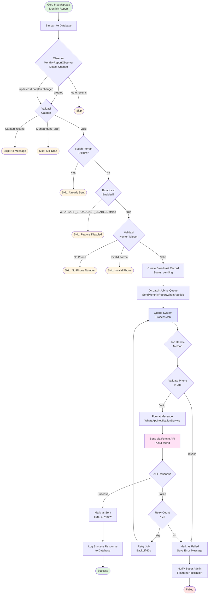
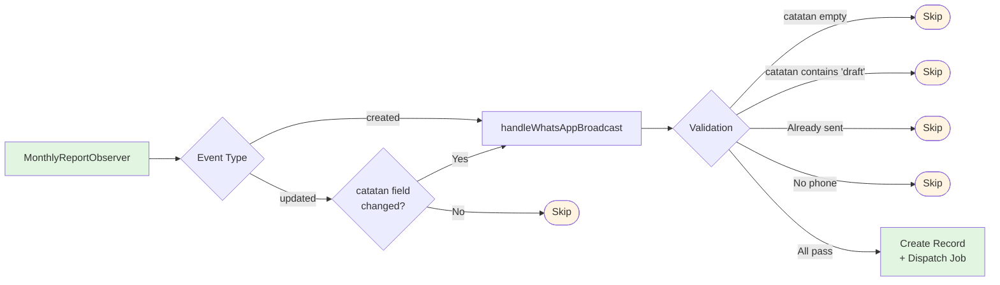
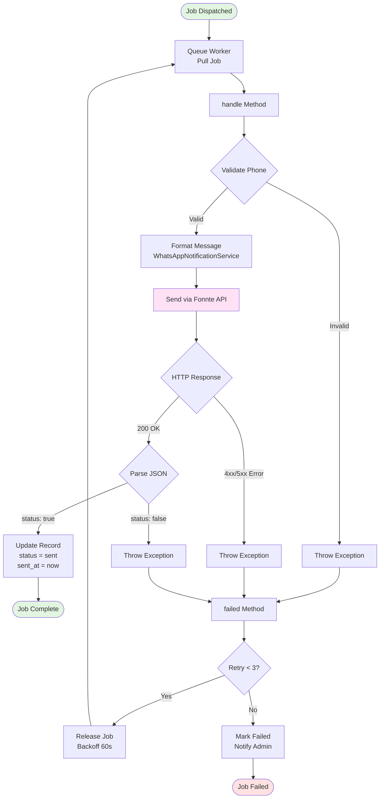
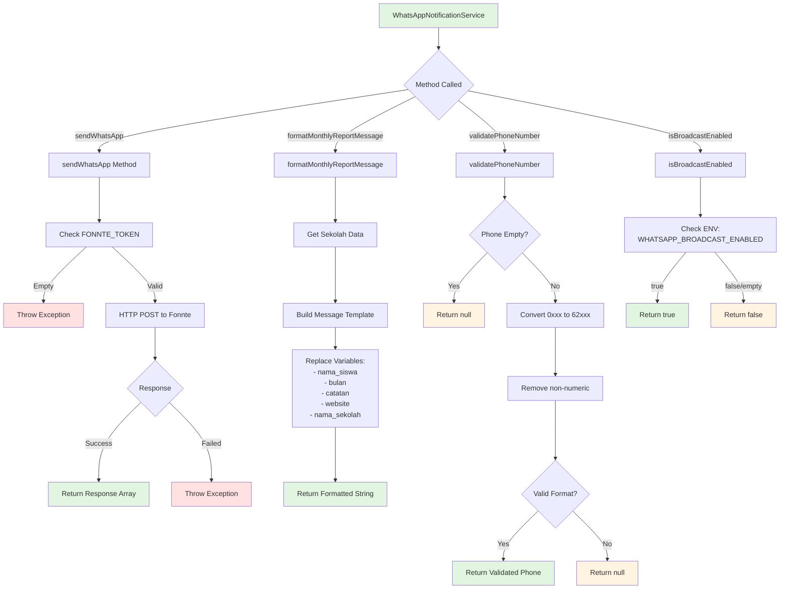
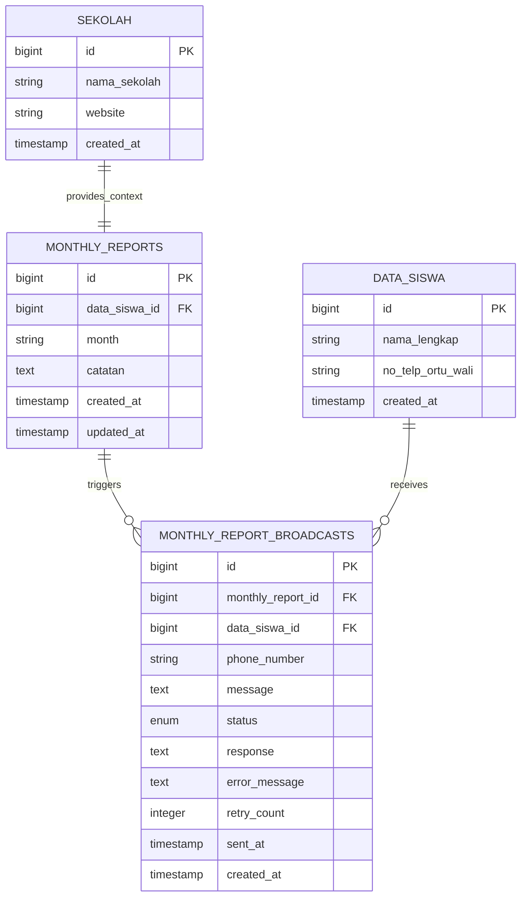
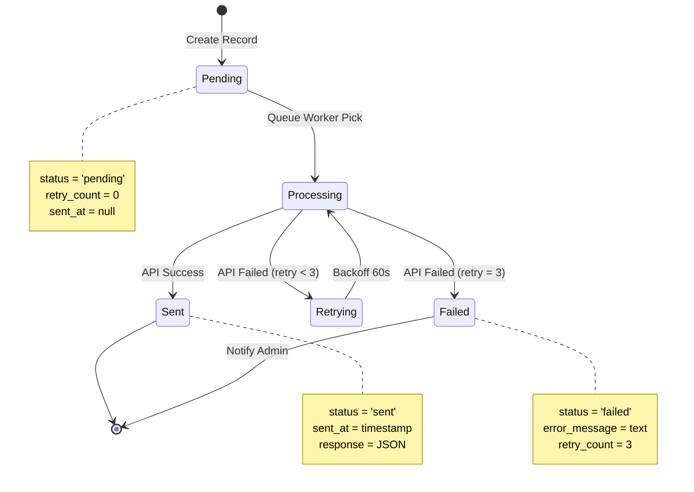
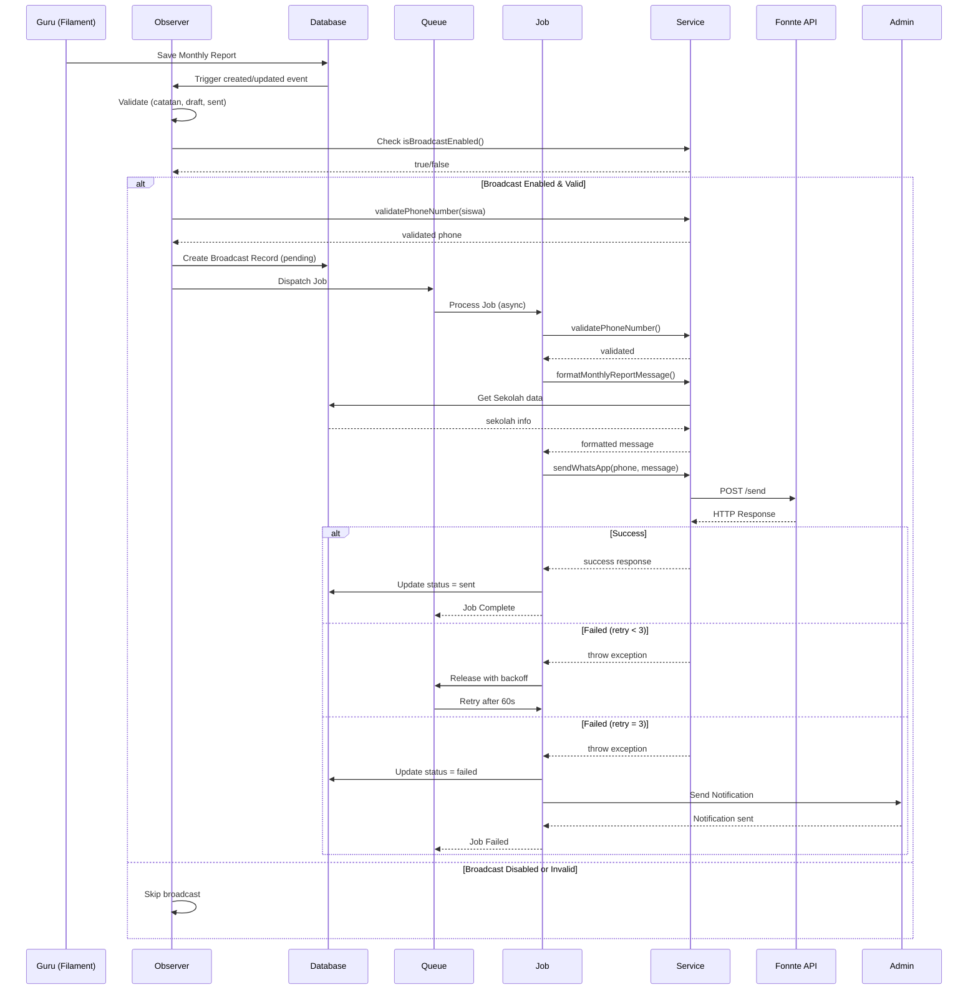
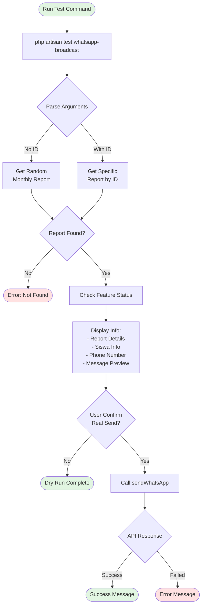
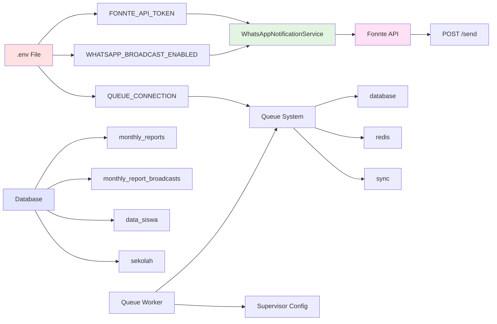
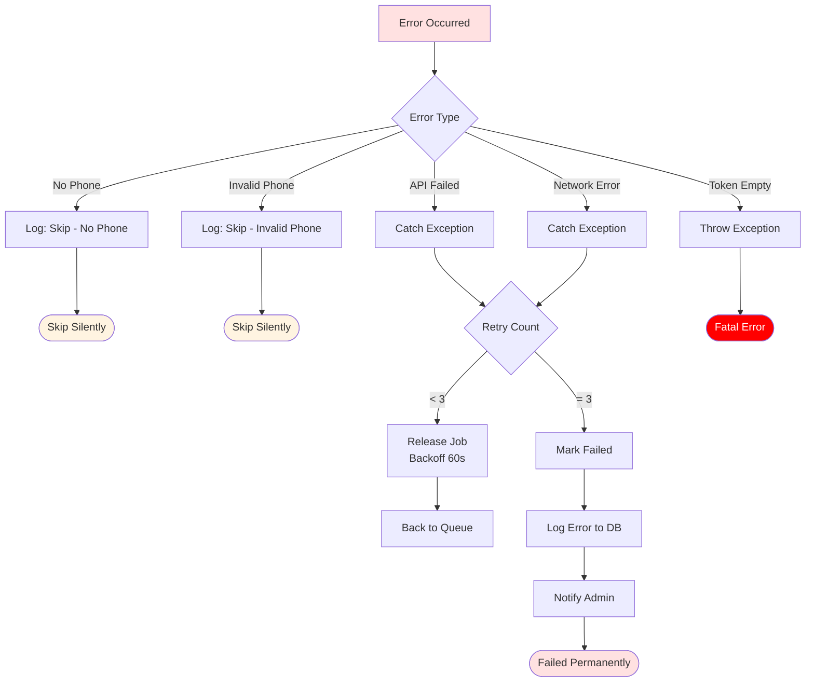

# Flowchart WhatsApp Broadcast System

Dokumentasi visual untuk sistem broadcast WhatsApp menggunakan Fonnte API.

## 1. Main Flow - Complete System

## 2. Observer Flow - Trigger Detection

## 3. Job Processing Flow - Queue Worker

## 4. Service Layer Flow - WhatsAppNotificationService

## 5. Database Schema Flow

## 6. State Machine - Broadcast Status

## 7. Sequence Diagram - Complete Interaction

## 8. Testing Flow

## 9. Configuration Dependencies

## 10. Error Handling Flow

---

## Legend

-   🟢 **Hijau**: Start/Success state
-   🔴 **Merah**: Error/Failed state
-   🟡 **Kuning**: Skip/Warning state
-   🔵 **Biru**: Processing/Queue state
-   🟣 **Ungu**: External API call

## Cara Menggunakan Flowchart

1. **Main Flow**: Gunakan untuk memahami alur lengkap dari input guru hingga WhatsApp terkirim
2. **Observer Flow**: Fokus pada trigger detection dan validasi awal
3. **Job Processing**: Detail proses queue worker dan retry mechanism
4. **Service Layer**: Memahami method-method dalam WhatsAppNotificationService
5. **Database Schema**: Struktur relasi antar tabel
6. **State Machine**: Status lifecycle dari broadcast record
7. **Sequence Diagram**: Interaksi antar komponen secara temporal
8. **Testing Flow**: Alur command testing
9. **Configuration**: Dependency antar komponen
10. **Error Handling**: Berbagai skenario error dan penanganannya

## Tools untuk View

Diagram ini menggunakan **Mermaid syntax** yang dapat di-render di:

-   ✅ GitHub (native support)
-   ✅ GitLab (native support)
-   ✅ VS Code (dengan extension "Markdown Preview Mermaid Support")
-   ✅ Online: https://mermaid.live/
-   ✅ Obsidian
-   ✅ Notion

---

**Created:** 28 Oktober 2025  
**Version:** 1.0.0
